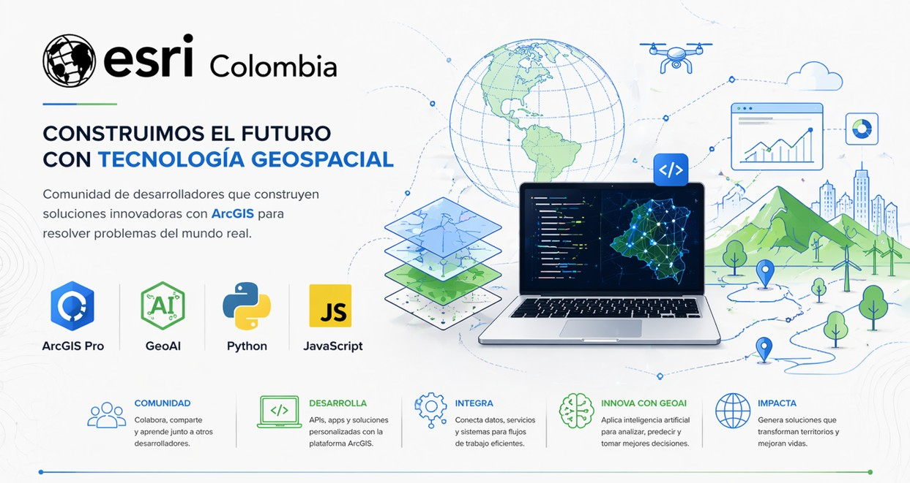

# Fabian Cetina

### Corporate-minded engineer delivering ArcGIS, geospatial and GeoAI products with engineering rigor

Ingeniero de desarrollo en **Esri Colombia**, enfocado en transformar necesidades de negocio en productos geoespaciales claros, mantenibles y listos para operar. Mi trabajo conecta **software engineering, ArcGIS, automatización e IA aplicada** con una mentalidad de producto, arquitectura y entrega continua.

---

## About

Diseño y construyo soluciones donde convergen contexto geoespacial, criterio técnico y foco de negocio.

- **ArcGIS y tecnología geoespacial** para productos y operaciones reales
- **Python, TypeScript y desarrollo moderno** para soluciones escalables
- **Automatización y developer workflows** para acelerar equipos con calidad
- **GeoAI e integración de capacidades inteligentes** con enfoque aplicado

Me interesa construir sistemas que funcionen más allá de la demo: con estructura, claridad arquitectónica, velocidad de ejecución y valor tangible para quienes los usan.

## Value Proposition

- Traduzco necesidades de negocio en soluciones técnicas concretas y ejecutables
- Conecto **GIS, backend, frontend e IA** sin perder claridad arquitectónica
- Equilibro visión de producto, mantenibilidad y capacidad real de operación
- Trabajo con una lógica simple: **menos discurso, más software útil y sostenible**

## What I Build

- Soluciones basadas en **ArcGIS** para casos de uso reales
- APIs, utilidades y componentes para productos internos y externos
- Flujos de automatización para acelerar equipos de desarrollo
- Experiencias y herramientas donde **GIS + IA** trabajan juntas
- Integraciones entre plataformas, servicios y datos geoespaciales

## Core Stack

## Current Focus

- Modernización de soluciones sobre el ecosistema **ArcGIS**
- Productividad de ingeniería mediante **tooling y automatización**
- Exploración de patrones de **GeoAI** aplicados a productos y flujos técnicos
- Diseño de software claro, mantenible y orientado a entrega

## Working Style

> **Build with intent. Operate with clarity. Improve continuously.**

Me interesan las soluciones bien pensadas, con estructura sólida, buena experiencia para el equipo y una ejecución técnica que se pueda sostener en el tiempo.

## Contact

- **Email:** [ecetina@esri.co](mailto:ecetina@esri.co)
- **GitHub:** [@ecetina-esri-co](https://github.com/ecetina-esri-co)

---

_Building at the intersection of ArcGIS, software engineering and GeoAI._

